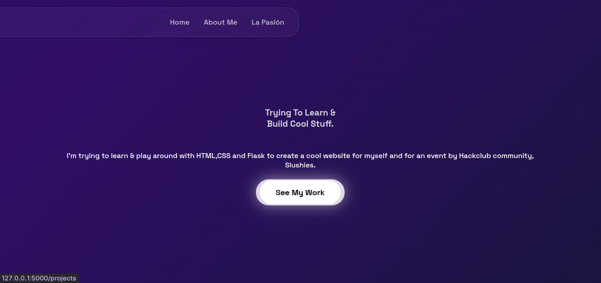
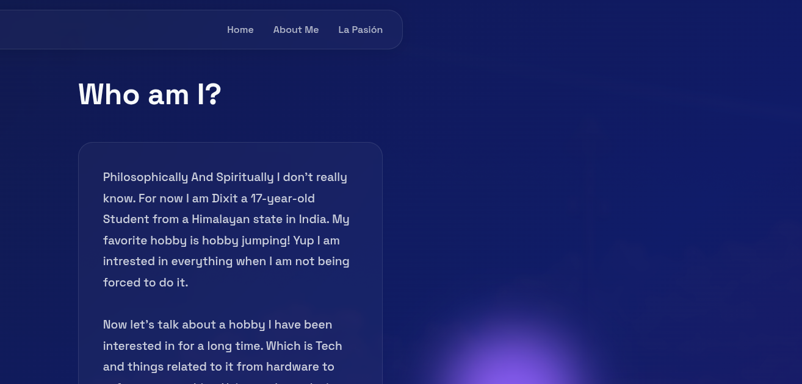
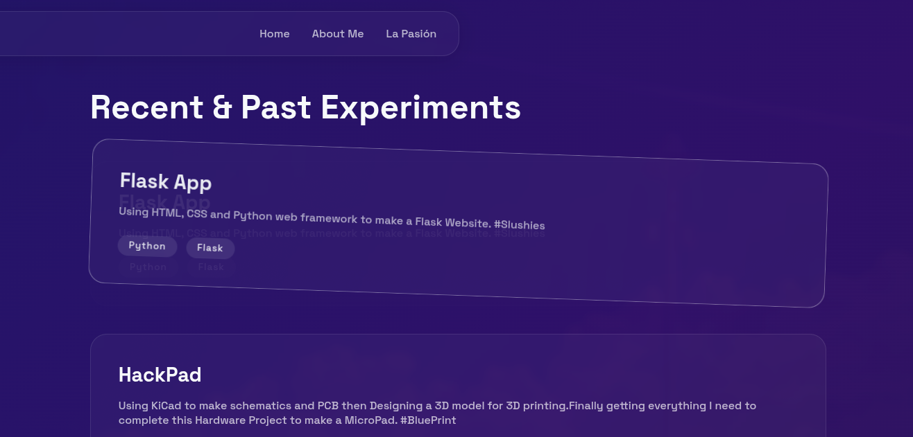

# My Personal Portfolio - Hack Club Slushies 🥤

This is a personal portfolio website( more like a about me  website) built with Python, Flask, HTML, and CSS. 
I created this to showcase my interests in tech, Linux, hardware, and content creation.Also to tell a bit about me.Who I am?

## Requirements Met
* **Framework:** Python + Flask
* **Routes:** 3 separate routes (Home, About Me, Projects)
* **Design:** Custom CSS with glassmorphism and animated backgrounds.

## Screenshots

